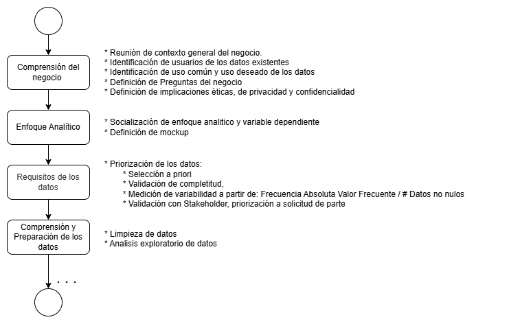
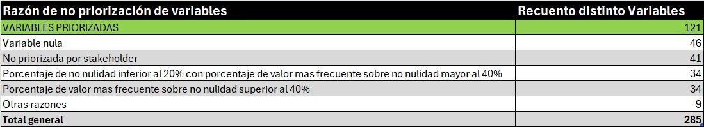

# MINE4213-Taller1
Presentado por:

- Lina Maria Bejarano - 
- Juan Diego Enríquez - 
- Juan Manuel Rivera  - 201534131
- Johana Alejandra Rátiva - 202513844

[Video entrega 1](https://www.youtube.com/watch?v=HGR5D20y1rQ)

# Objetivo

El objetivo de este proyecto es explorar el dataset de datos clinicos de trasplantes hepaticos de la Fundación Santa Fe de Bogotá que cuenta con 736 registros y 286 varaibles. A partir de esta exploración se busca generar una base de datos limpia que permita el desarrollo de un tablero de control en Power BI que apoye la generación de reportes, la investigación clinica y mejore la toma de decisiones clinicas a partir de una comprensión mas clara del estado del paciente y sus posibles complicaciones postrasplante. Para ello se hará uso de la metodología ASUM-DM, analisis exploratorio y se implementará clasificación supervisada a partir de  una regresión logistica.   

# Alcance

EL siguiente proyecto de ciencia de datos hace uso de la metodología ASUM-DM, en esta primera entrega se llevan a cabo las fases: Comprensión del negocio, enfoque analítico, requisitos de los datos y comprensión y preparación de los datos. A continuación, se muestra el flujo de ejecución junto con las actividades realizadas en cada una de ellas.

## Fase 1: Comprensión del negocio

La Fundación Santa Fe de Bogotá cuenta con un servicio de cirugía hepatobiliar y de trasplantes que, de la mano de sus médicos rurales y bajo el acompañamiento de la médica Valentina Mejía, ha venido consolidando información de pacientes sometidos a trasplante hepático. Esta información, antes dispersa en diversas fuentes, fue integrada en una base de datos que representa un esfuerzo significativo de consolidación de variables operativas, clínicas, quirúrgicas y epidemiológicas. A partir de ella se busca:

* Desarrollar un panel interactivo o Power BI que permita consolidar esta base de datos, facilitando análisis clínico, operativo y epidemiológico de los pacientes sometidos a trasplante hepático.  
* Facilitar la generación de reportes del año rural y obtener un panorama general poblacional de los trasplantes.  
* Apoyar la toma de decisiones clínicas mediante una comprensión más clara del estado del paciente y sus posibles complicaciones postrasplante.  
* Impulsar la investigación clínica al permitir el análisis de supervivencia y otros indicadores como factores de riesgo por grupos poblacionales o por año de trasplante.

Para evaluar el impacto de este proyecto de ciencia de datos se usarán los siguientes KPIs (Indicador clave de desempeño):  
* Porcentaje de datos no nulos: medir el porcentaje de mejora en la completitud y calidad de los datos, incentivando una captura más limpia en futuras iteraciones a partir del uso de diccionarios de datos.   
* Tiempo promedio de depuración de los datos: Medir el tiempo pre y pos desarrollo del dashboard, respecto a la duración del proceso de limpieza/estandarización de la data.  
* Tiempo promedio de entendimiento del estado del paciente: Medir el tiempo promedio en el que se pueden entender los datos del paciente, ya que la herramienta facilita la lectura integral de un caso clínico a través de un perfil dinámico que reúne variables significativas 8pre y pos desarrollo de la herramienta.  
* Número de hipótesis o estudios derivados: cuantificar el aporte del análisis exploratorio y del dashboard en la investigación clínica a partir de la participación en eventos de investigación (abstracts enviados, manuscritos sometidos/publicados) y generación de nuevas líneas o proyectos de investigación clínica.  
* Frecuencia de uso de los datos: medir el aumento del acceso y aprovechamiento de la información consolidada, antes subutilizada por su complejidad y volumen.

## Fase 2: Enfoque analítico

### Ideación 

Dentro del servicio de cirugía hepatobiliar y de trasplantes, los médicos rurales constituyen el principal grupo de usuarios que alimenta y consulta la base de datos consolidada de trasplante hepático. Como se mencionó previamente, estos usuarios realizan dos usos principales de la información: generan reportes operativos y realizan investigación clínica. 
Adicionalmente, los médicos buscan que esta información sirva para identificar tempranamente factores de riesgo o vulnerabilidad frente a posibles complicaciones postrasplante. Sin embargo, esta necesidad se ve limitada por la complejidad y extensión de la base de datos, así como por problemas de calidad y limpieza de los registros, lo que dificulta el análisis y la identificación de patrones relevantes. Por eso se plantea como solución el uso de un tablero de control en power BI en donde se proponen 3 vistas principales.

* Panorama general de trasplantes: permite la generación de reportes operativos y la descripción poblacional de las cirugías realizadas. Incluye filtros por grupo etario, sexo, año y otras variables demográficas o clínicas de interés.  
* Perfil del paciente: muestra información individual asociada a complicaciones (infección, cáncer postrasplante, inmunodeficiencia, entre otras) y a las variables identificadas como relevantes en las etapas de análisis exploratorio y modelamiento. Facilita la comprensión del estado del paciente y de sus riesgos asociados.  
* Análisis de sobrevida poblacional: proyecta los resultados del análisis exploratorio, mostrando tasas de supervivencia por grupo etario, sexo o año de trasplante, junto con las dependencias o variables que más inciden en estos resultados.

Cabe aclarar, que antes de cargar la base de datos a power BI se desarrolla la elección de variables clínicas relevantes y un script en python para llevar a cabo un proceso de limpieza de la data. 

### Responsible

De acuerdo con la Resolución 8430 de 1993 del Ministerio de Salud de Colombia, la investigación realizada se clasifica como sin riesgo, dado que se emplean datos retrospectivos anonimizados.
El acceso a la información se realizó bajo un acuerdo de confidencialidad suscrito con el Servicio de Trasplantes, garantizando el uso ético, seguro y conforme a la Ley 1581 de 2012 sobre protección de datos personales.

Nota: Se anexa el acuerdo de confidencialidad firmado por las partes, el cual respalda el cumplimiento de los principios de confidencialidad, legalidad y finalidad en el manejo de la información.

### Enfoque analítico

El análisis se centra en explorar y modelar los factores asociados a la presencia de complicaciones postoperatorias (variable dependiente depurada para garantizar consistencia).

Primero, se realiza un Análisis Exploratorio de Datos (EDA) para identificar patrones, distribuciones y posibles relaciones entre variables clínicas y quirúrgicas. Luego, se aplica una Regresión Logística para estimar la probabilidad de complicación a partir de las variables más relevantes.

Las hipótesis se orientan a determinar si características como la edad, el estadio del tumor o marcadores bioquímicos influyen significativamente en el riesgo de complicación.

El modelo se evaluará con métricas de desempeño como exactitud (accuracy), precisión, y recall , con el fin de medir su capacidad predictiva y su validez estadística.

## Fase 3: Requisitos de datos

La base de datos de trasplantes hepáticos fue recibida el 25 de septiembre de 2025, con un total de 736 registros y 285 variables clínicas. A partir de esta información se diseñó una estrategia de priorización de datos estructurada en cuatro etapas principales:

1. Selección inicial basada en la pregunta de negocio: Se realizó una primera selección de variables relevantes (114 en total) que permitieron iniciar el proceso de limpieza y exploración.  
2. Evaluación de completitud de datos: Tras el tratamiento de valores nulos, se aplicó un conteo de completitud utilizando la función df.info(). En esta etapa se eliminaron aquellas variables completamente vacías o con ausencia total de registros útiles.  
3. Medición de variabilidad y consistencia de los datos: Se calculó la frecuencia relativa del valor más común sobre el total de datos no nulos. Se descartaron aquellas variables con baja variabilidad (por ejemplo, donde el valor más frecuente representaba más del 40% de los datos no nulos), así como aquellas con niveles de completitud muy bajos (entre 1% y 20%).  
4. Validación con el stakeholder: Finalmente, se realizó una revisión conjunta para asegurar la pertinencia de las variables en función de los objetivos clínicos y analíticos, descartando aquellas que no fueron priorizadas por el equipo experto.

Como resultado, se obtuvo una base depurada de 121 variables seleccionadas para el proceso de limpieza avanzada y el análisis estadístico posterior.

A continuación se muestra el resultado de la estrategia de priorización de datos

Nota: Adjunto al repositorio se encuentra el diccionario de datos detallado.

## Fase 4: Comprensión y preparación de dato

En esta etapa se realizaron actividad de limpieza y preparacón de datos como también analisis exploratorio univaraido y bivariado, los resultados se pueden encontrar en los cuadernillos adjuntos de limpieza de datos y EDA. 

# Conclusiones (insights)

* La variable “¿Complicación?” requiere un proceso adicional de depuración y homologación antes de avanzar hacia la modelación predictiva, ya que presenta inconsistencias con variables complementarias como:
Complejidad_asociada, #_de_complicaciones, arritmia_pop, falla_cardiaca, infección, rechazo_agudo, rechazo_cronico e infarto.
Estas discrepancias pueden afectar la coherencia de los resultados y la validez del modelo.

* Se evidencia que los pacientes que requieren soporte intraoperatorio tienden a presentar mayor frecuencia de complicaciones postoperatorias.
Este comportamiento podría estar relacionado con el uso de hormonas vasoactivas como vasopresina y noradrenalina, las cuales —según la literatura— podrían estar asociadas con la aparición de complicaciones tras el trasplante.

* Variables como Estadio y Grado_HCC muestran tendencias clínicas relevantes:

* Los estadios tumorales más avanzados y los grados histológicos más altos presentan mayor proporción de complicaciones y aunque no resultaron estadísticamente significativas, estas variables tienen sentido clínico, dado que una menor diferenciación celular suele asociarse con mayor agresividad tumoral y, en consecuencia, mayor riesgo de complicaciones.

* Dada la complejidad inherente a los datos clínicos, se recomienda continuar con análisis multivariados que permitan capturar la interacción entre variables y profundizar en la identificación de factores asociados a las complicaciones postoperatorias.

# Instrucciones de ejecución

La ejecución tiene el siguiente orden: Primero se ejecuta el cuadernillo de limpieza con el cual se obtendrá una sabana de datos limpia que será importada en el cuadernillo de Analisis exploratorio. En ambos cuadernillos se puede encontrar información relevante de la ejecución y interpretación de resultados. 

# Dependencias

Antes de la ejecución asegurarse de tener las librerias

pandas numpy matplotlib seaborn scipy

El dataset sera enviado por correo por confidencialidad, se debe subir a la carpeta ya que se usó rutas relativas.
